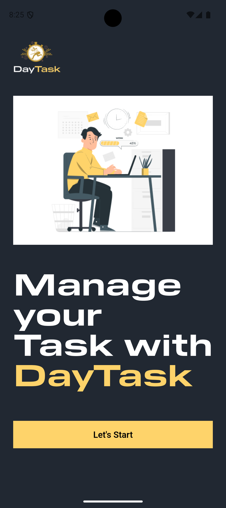
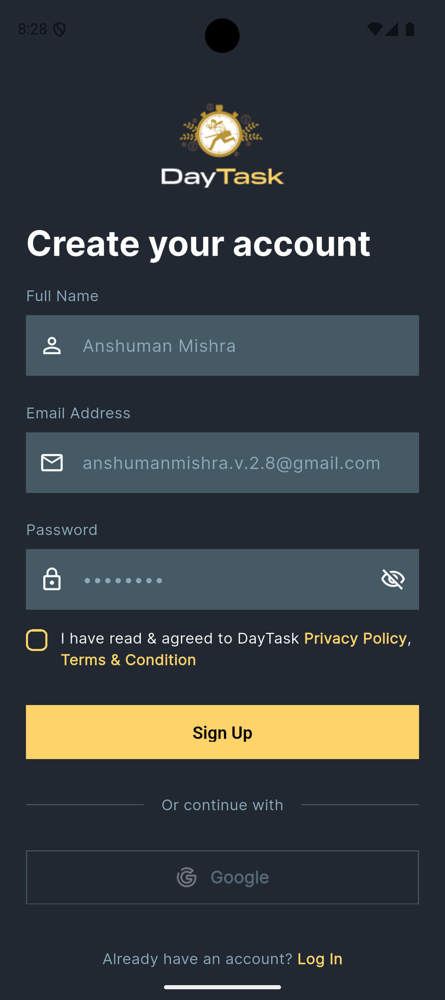
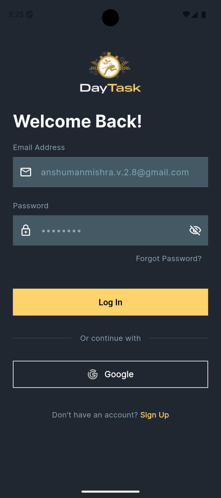
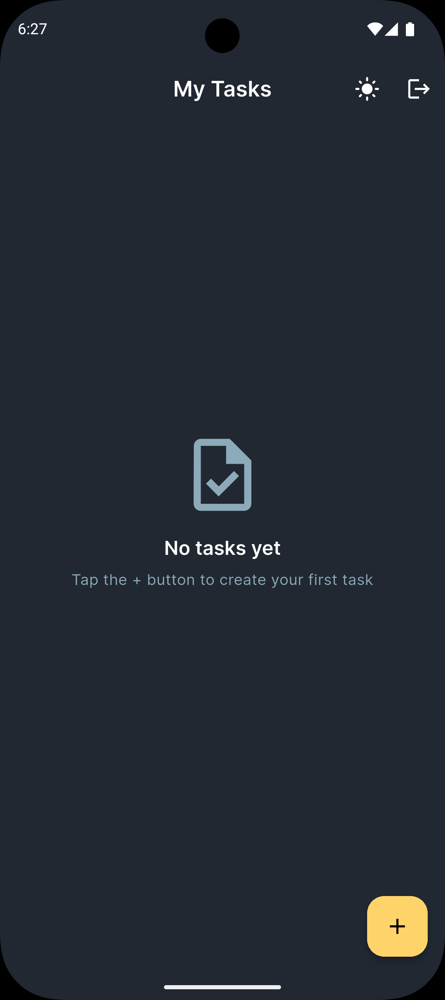
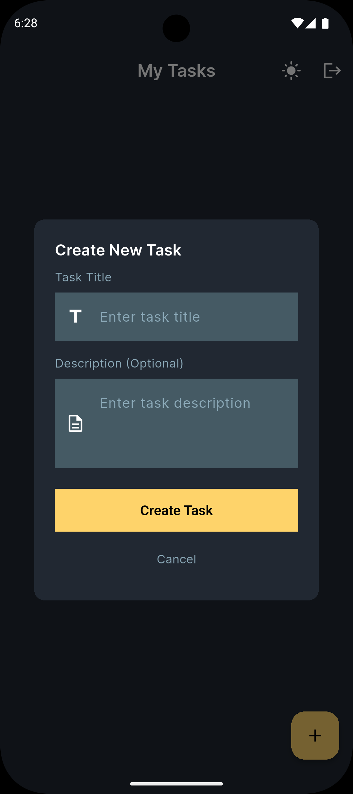
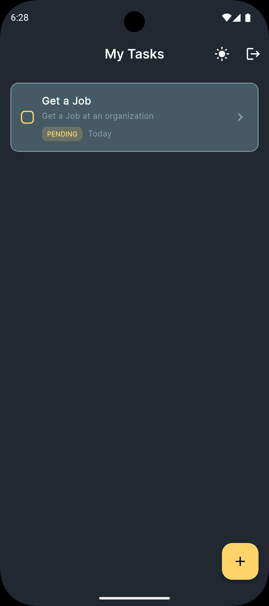
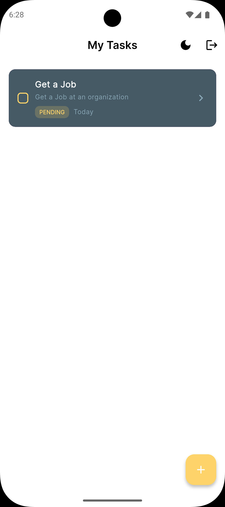

# TaskHub - Personal Task Tracker

TaskHub is a simple and clean task management app built with Flutter. It helps you organize your daily tasks with an intuitive interface and secure authentication.

## 🚀 Setup Instructions

To get started with TaskHub, follow these steps:

### 1. Clone the Repository

First, clone the repository and navigate to the project directory:

```bash
git clone <repository-url>
cd TaskHub/taskhub
```

### 2. Install Dependencies

Install all required packages:

```bash
flutter pub get
```

### 3. Supabase Setup

Before running the app, you'll need to set up your Supabase database:

**Create the Tasks Table**

1. Open your Supabase Dashboard and go to the SQL Editor
2. Run the following SQL script to create the tasks table:

```sql
CREATE TABLE tasks (
  id UUID DEFAULT gen_random_uuid() PRIMARY KEY,
  user_id UUID REFERENCES auth.users(id) ON DELETE CASCADE,
  title TEXT NOT NULL,
  description TEXT,
  status TEXT DEFAULT 'pending' CHECK (status IN ('pending', 'completed')),
  created_at TIMESTAMP WITH TIME ZONE DEFAULT NOW(),
  updated_at TIMESTAMP WITH TIME ZONE DEFAULT NOW()
);
```

**Enable Row Level Security (RLS)**

1. Navigate to Authentication → Policies in your Supabase dashboard
2. Enable RLS on the `tasks` table

**Create RLS Policies**

Create four policies for the `tasks` table (SELECT, INSERT, UPDATE, DELETE) with the condition:

```
auth.uid() = user_id
```

This ensures each user can only access their own tasks.

**Configure Authentication**

1. Go to Authentication → Providers
2. Enable the Email provider
3. Enable the Google provider if you want to use Google Sign-In

### 4. Run the App

Once everything is set up, you can run the app:

```bash
flutter run
```

## 🔄 Hot Reload vs Hot Restart

When developing with Flutter, you have two options for seeing your changes:

### Hot Reload (⚡)

Hot reload is your go-to option for quick UI updates. It updates your app's interface almost instantly (1-2 seconds) without losing any app state. This means your variables, form inputs, and scroll positions all stay exactly where they were.

**Best for:**

- Changing colors, text, or layout
- Modifying widget build methods
- Adjusting styling

**How to use:**

- Press `r` in the terminal, or
- Click the hot reload button in your IDE

### Hot Restart (🔄)

Hot restart completely restarts your app from scratch, which means all app state gets reset. It takes a bit longer (5-10 seconds) but is necessary for certain types of changes.

**Use when:**

- Adding or removing dependencies
- Modifying the `main()` function
- Changing app initialization code
- Hot reload isn't working for your changes

**How to use:**

- Press `R` (capital R) in the terminal, or
- Click the hot restart button in your IDE

**Pro tip:** Always try hot reload first - it's much faster! Only use hot restart when you need to.

## 📸 Screenshots

### Splash Screen



### Authentication

#### Sign Up Screen



#### Sign In Screen



### Dashboard

#### Dashboard Screen



#### Task Creation Screen



### Theme Modes

#### Home Screen (Dark Mode)



#### Home Screen (Light Mode)



## ✨ Bonus Features

The app also includes some nice-to-have features:

- Real-time task updates across devices
- Light and dark theme toggle
